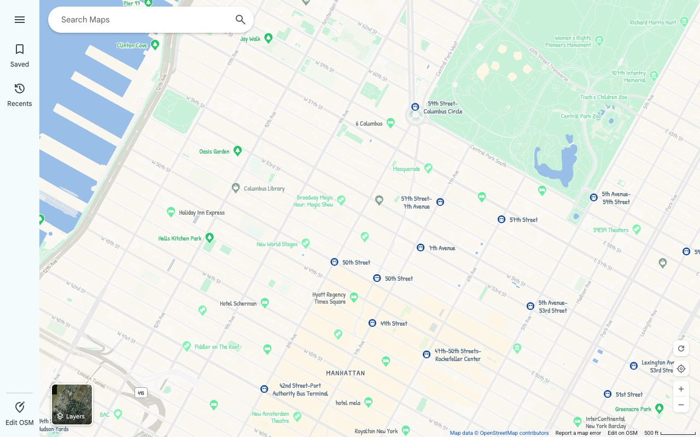
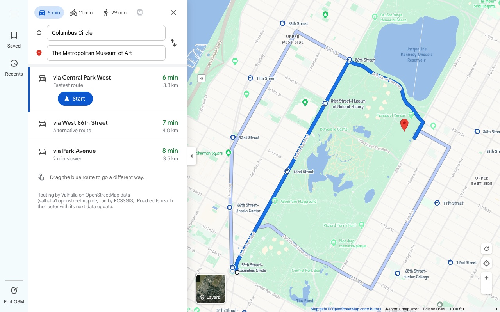
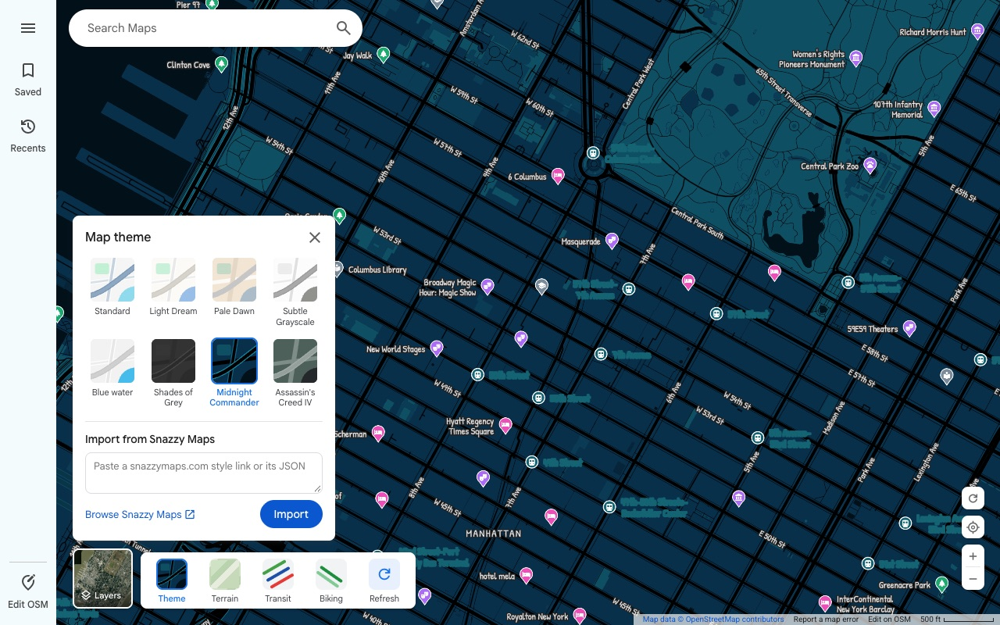
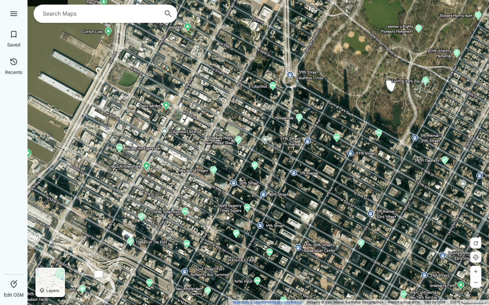

# OpenGleam Maps

**A fast, familiar web map built entirely on OpenStreetMap.**

Search, place details, turn-by-turn directions, themes and a **Refresh** button that shows your OSM edits right away.

---

## Features

<table>
<tr>
<td width="50%" valign="top">

### See your edits right away
When you edit OSM, the change usually takes minutes to show up on tiles. The **Refresh** button skips that wait:
- it re-fetches vector tiles with a cache-busting token;
- it pulls the last 3 hours of changesets in view straight from the OSM editing API;
- it draws those changesets as a live overlay.

### Directions
- Routing by **Valhalla** for driving, cycling and walking, with alternative routes.
- **Drag the route** to add a via point, which snaps to roads and trails.
- The step-by-step list stays hidden until you press **Start**.
- Your current location can be the starting point.

### Search & places
- Search-as-you-type from **Photon**, with recent searches.
- Place panels use **Nominatim**, with photos from **Wikidata / Wikimedia Commons**.
- Each place has a collapsible row of raw OSM tags.
- Saved places are kept in your browser.

</td>
<td width="50%" valign="top">

### Snazzy Maps themes
- **Light Dream** is the default theme, and there are presets such as Midnight Commander and Assassin's Creed IV.
- You can import any style from [snazzymaps.com](https://snazzymaps.com) by pasting its link or its JSON.
- Imported styles are translated into MapLibre paint rules on the fly.

### Layers
- Map / satellite toggle (Esri World Imagery).
- **Theme**, **Terrain** (hillshade), **Transit** and **Biking** overlays.

### Little touches
- All map labels are hand-lettered in **Patrick Hand**; scripts the font doesn't cover fall back to Roboto.
- A **Show your location** toggle with an accuracy halo.
- Zoom buttons step by half a zoom level for finer control.
- Links to *Edit on OSM* and *Report a map error* are one click away.

</td>
</tr>
</table>

---

## Screenshots

| Directions with alternates | Themes |
| :---: | :---: |
|  |  |
| **Satellite** | **Light Dream (default)** |
|  |  |

---

## Website
https://ltorl.github.io/open-gleam-maps

---

## Data sources & credits

OpenGleam is a front end only. The data and services all come from these open projects. Please respect their usage policies.

| What | Provided by |
| --- | --- |
| Map data | © [OpenStreetMap](https://www.openstreetmap.org/copyright) contributors, [ODbL](https://opendatacommons.org/licenses/odbl/) |
| Vector tiles | [vector.openstreetmap.org](https://vector.openstreetmap.org) ([Shortbread](https://shortbread-tiles.org) schema) |
| Live edits | [OpenStreetMap API](https://wiki.openstreetmap.org/wiki/API_v0.6) |
| Routing | [Valhalla](https://github.com/valhalla/valhalla) on the [FOSSGIS](https://fossgis.de) server |
| Search | [Photon](https://photon.komoot.io) by komoot · [Nominatim](https://nominatim.org) · [Overpass API](https://overpass-api.de) |
| Place photos | [Wikidata](https://www.wikidata.org) · [Wikimedia Commons](https://commons.wikimedia.org) |
| Satellite | Esri World Imagery (Esri, Maxar, Earthstar Geographics) |
| Terrain | [Terrarium elevation tiles](https://registry.opendata.aws/terrain-tiles/) on AWS Open Data |
| Themes | [Snazzy Maps](https://snazzymaps.com) and their style authors |
| Label font | [Patrick Hand](https://github.com/google/fonts/tree/main/ofl/patrickhand) by Patrick Wagesreiter, [SIL OFL 1.1](src/fonts/PatrickHand-OFL.txt) |
| Fallback glyphs | [OpenMapTiles fonts](https://github.com/openmaptiles/fonts) |
| Rendering | [MapLibre GL JS](https://maplibre.org) |

**Found something wrong on the map?** [Fix it on OpenStreetMap](https://www.openstreetmap.org/fixthemap), then hit **Refresh** to see it.

